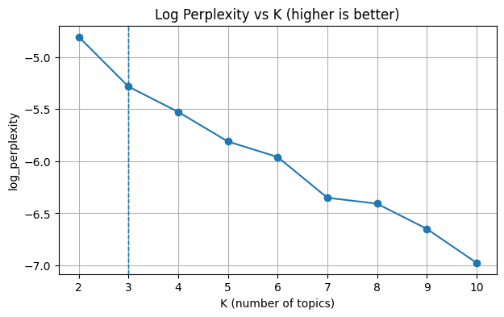
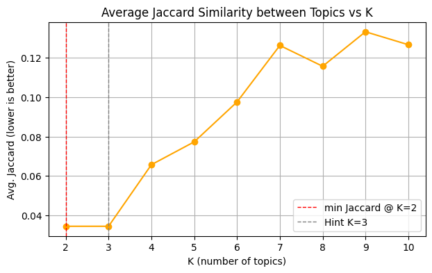

# Topic Modeling for Mobile Banking App Reviews

**A Natural Language Processing Project for Korean Financial Services UX Enhancement**

---

## 📘 Project Overview

This project implements an **automated topic extraction and analysis system** for Korean mobile banking application reviews.  
It was developed as a **proof-of-concept (PoC)** within the digital platform enhancement initiatives at **Korea Securities Finance Corporation (KSFC)** to identify recurring user pain points and inform UX improvement strategies.

---

## ⚠️ Disclaimer

This repository presents a **simplified demonstration version** of the topic modeling methodology.  
For privacy and confidentiality reasons:
- Actual customer data and internal infrastructure are **not included**.
- The demo uses **publicly available app store reviews (~300 samples)**.
- The production-scale version processes 10,000+ monthly inquiries and includes enterprise-grade security and monitoring.

---

## 🧩 Technical Summary

| Component | Description |
|------------|-------------|
| **Language** | Korean (morphologically rich, domain-specific) |
| **Model** | Latent Dirichlet Allocation (BoW + TF-IDF) |
| **Visualization** | pyLDAvis interactive topic visualization |
| **Evaluation** | Coherence (c_v, u_mass, npmi, uci), Log Perplexity, Jaccard Similarity |
| **Labeling** | Word2Vec centroid-based automatic topic labeling |

---

## ⚙️ Architecture Overview

---

## 🧠 Methodology Highlights

### 1. Korean Text Preprocessing
- HTML/entity decoding and special character cleanup  
- Domain-specific dictionary (50+ financial terms)  
- Morphological tokenization with KoNLPy’s Komoran  
- Multi-level compound term merging (e.g., “공동 인증 서” → “공동인증서”)  

### 2. Dual Topic Modeling
- **BoW-based LDA**: captures general thematic structure  
- **TF-IDF-based LDA**: emphasizes rare but informative words  
- Configurable hyperparameters: topic count, passes, min/max term frequency  

### 3. Evaluation Framework
| Metric | Goal | Interpretation |
|--------|------|----------------|
| **Coherence (c_v, npmi, uci)** | ↑ Higher | Human judgment correlation |
| **U_mass** | ↓ Lower | Corpus-based coherence |
| **Log Perplexity** | ↑ Higher | Generalization quality |
| **Avg Jaccard** | ↓ Lower | Topic distinctiveness |

> The optimal number of topics **K=3** was selected for best balance between coherence and topic diversity.

### 4. Automated Topic Labeling
Each topic’s label is chosen automatically using:

Score(candidate) = cosine_similarity(center, w2v[candidate])
+ LDA_weight_bonus
+ domain_term_bonus

  ---

## 📊 Results Summary

**Dataset:** 318 Korean app store reviews  
**Optimal Topic Count (K):** 3  

| Topic | Label | % Docs | Top Terms |
|-------|--------|--------|-----------|
| 0 | 로그인 (Login) | 46% | 로그인, 공동인증서, 등록, 인증, 금융인증서 |
| 1 | 인증 (Authentication) | 20% | 인증서, 발급, 조회, 갱신, 방법 |
| 2 | 가입 (Registration) | 34% | 가입, 설치, 디자인, 회원, 다운로드 |

**Evaluation Snapshot**

| Metric | K=2 | **K=3** | K=4 | K=5 |
|--------|-----|---------|-----|-----|
| Coherence (c_v) | 0.491 | **0.496** | 0.465 | 0.478 |
| U_mass | -15.27 | **-14.43** | -14.21 | -14.45 |
| Log Perplexity | -4.88 | **-5.30** | -5.56 | -5.78 |
| Avg Jaccard | 0.034 | **0.034** | 0.066 | 0.078 |

> **K=3** provided optimal interpretability, coherence, and minimal topic overlap.

### Evaluation Visualizations

| Metric | Interpretation |
|--------|----------------|
|  | **Coherence (c_v) vs K** — Higher is better (semantic consistency) |
|  | **Coherence (u_mass) vs K** — Lower is better (corpus-based coherence) |
|  | **Log Perplexity vs K** — Higher (less negative) indicates better generalization |
|  | **Average Jaccard Similarity** — Lower indicates less topic redundancy |

---

## 🖥️ Example Outputs

**Visualizations**
- `lda_c_v_vs_k.png` — Coherence vs. topic count  
- `lda_u_mass_vs_k.png` — U_mass trends  
- `lda_logppl_vs_k.png` — Log Perplexity vs K  
- `lda_avg_jaccard_vs_k.png` — Topic redundancy  
- `bow_lda_topic_visualization.html` — Interactive BOW model  
- `tfidf_lda_topic_visualization.html` — Interactive TF-IDF model  

**Data Exports**
- `lda_k3_dominant_topics.csv` — Document-topic assignments  
- `lda_k3_topic_summary.csv` — Topic summaries  
- `lda_k3_topic{N}_{label}.csv` — Documents per topic  

---

## 🧮 Technical Highlights
	•	Domain-specific preprocessing for Korean financial language
	•	Multi-metric evaluation (coherence, perplexity, Jaccard)
	•	Automated semantic topic labeling using Word2Vec
	•	Interpretable, reproducible, and extensible pipeline

⸻

### 👨‍💻 Author
	•	Yongjun Lee
	•	Manager, Digital Strategy Department – Korea Securities Finance Corporation
	•	🎓 B.S. in Computer Science & Engineering, Yonsei University (2013)
	•	📧 andrewyj.yi@gmail.com
	•	🌐 github.com/AndrewLee-Korea
